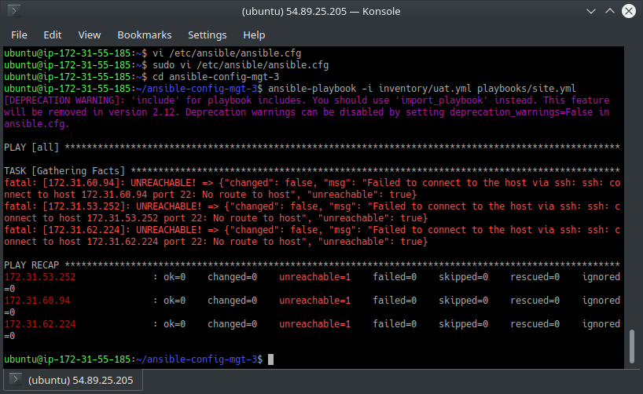
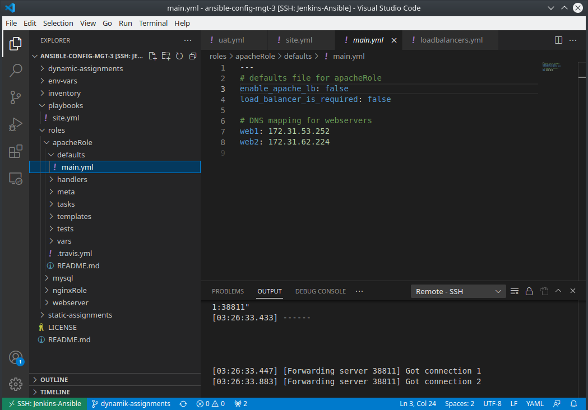
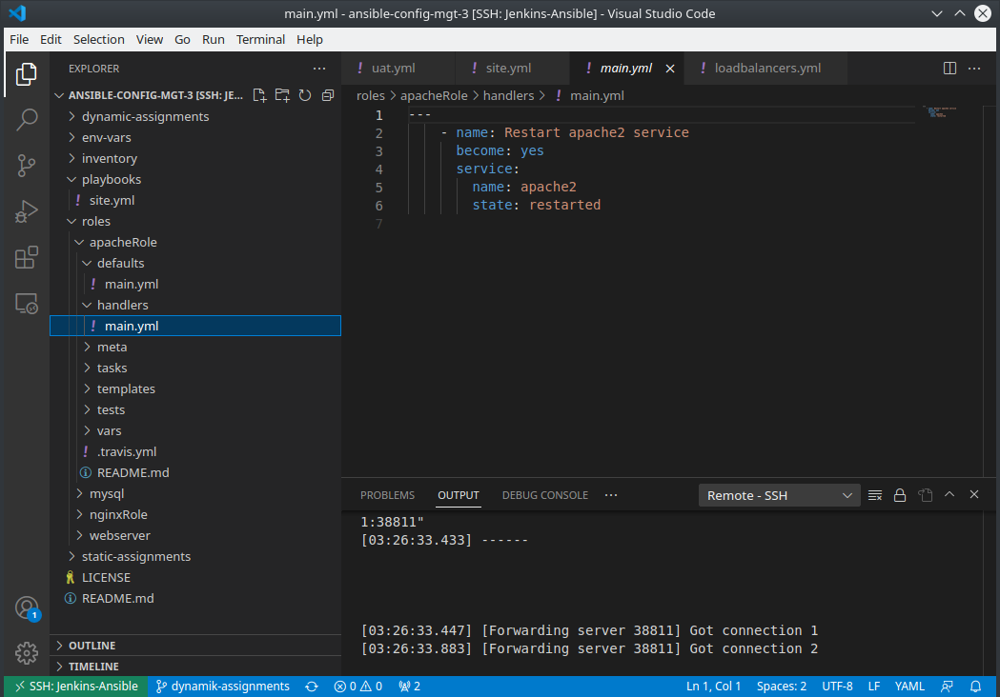
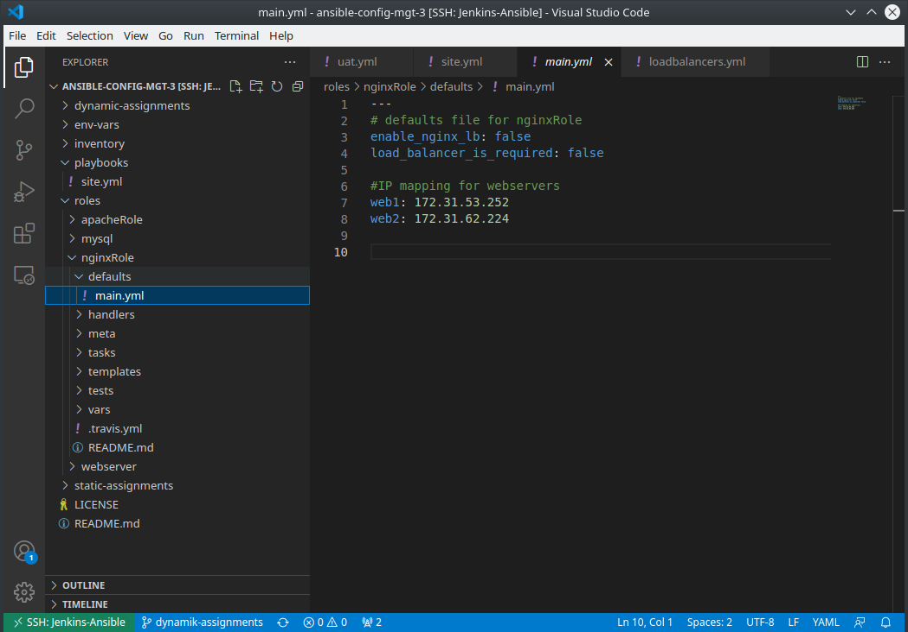
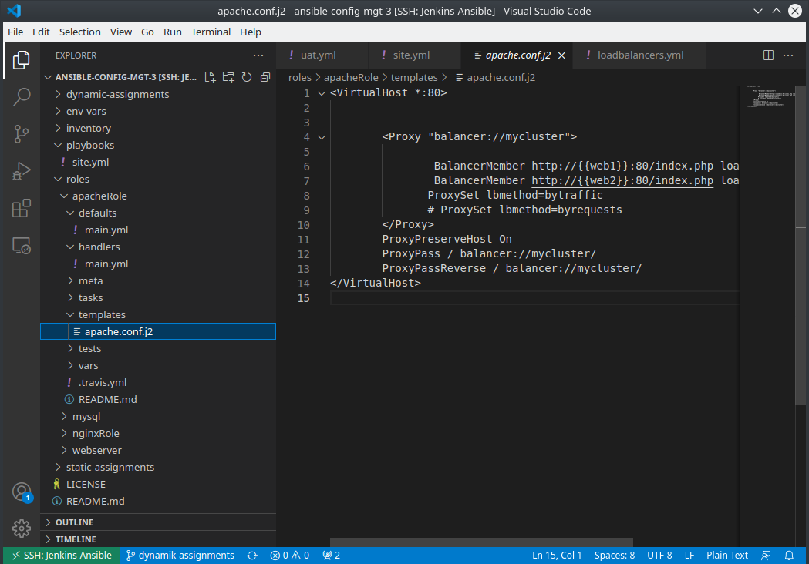
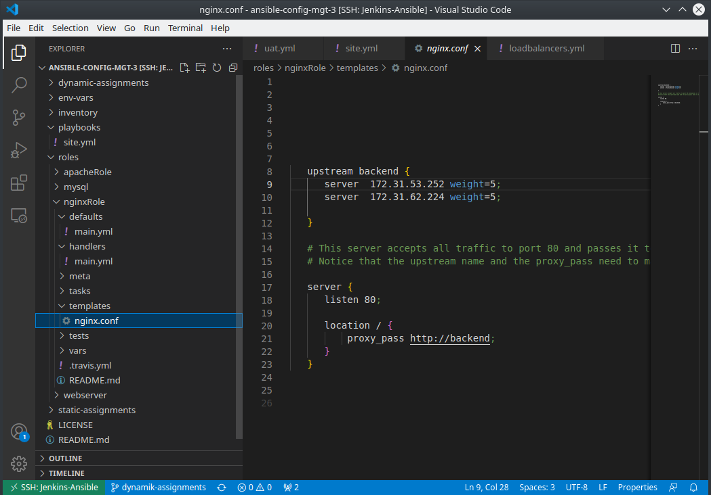
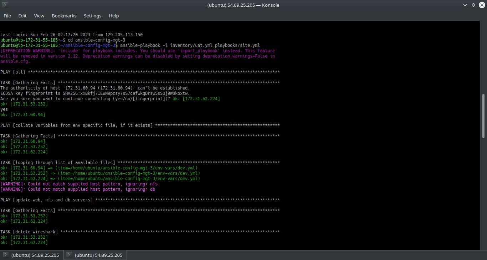

### Project 13 speaks of the contrast between Dynamic and Static Assignments in ansible  which is Include and Import statement when calling a playbook inside another . Dynamic Asssignment(include) is the ability for ansible to capture the modofication made to an ansible script after it has been parsed initially. while the case of  static assignment(import) it does not. it only execute that commands that was parsed earlier.therefore ignoring the modification at runtime 

#### Banjo Babade Project 13 darey.io DevOps learning platform
#### had to fork ansible-config-mgt-3 from uzukwujp's repo on git hub the geelingguy predefined role on ansible-galaxy was difficult for me to modify and use

#### remember modify the file etc/ansible/ansible.cfg by uncommenting and set roles_path = /hom toe/ubuntu/ansible-config-mgt-3/roles

##### https://github.com/Bjrules/ansible-config-mgt-3.git is contains the project itself

[label](IMG-SCREENSHOTS/Screenshot_20230226_040536.png%0D) [label](IMG-SCREENSHOTS/Screenshot_20230226_040847.png%0D) [label](IMG-SCREENSHOTS/Screenshot_20230226_040917.png%0D) [label](IMG-SCREENSHOTS/Screenshot_20230226_040950.png%0D) [label](IMG-SCREENSHOTS/Screenshot_20230226_041036.png%0D) [label](IMG-SCREENSHOTS/Screenshot_20230226_041040.png%0D) 
